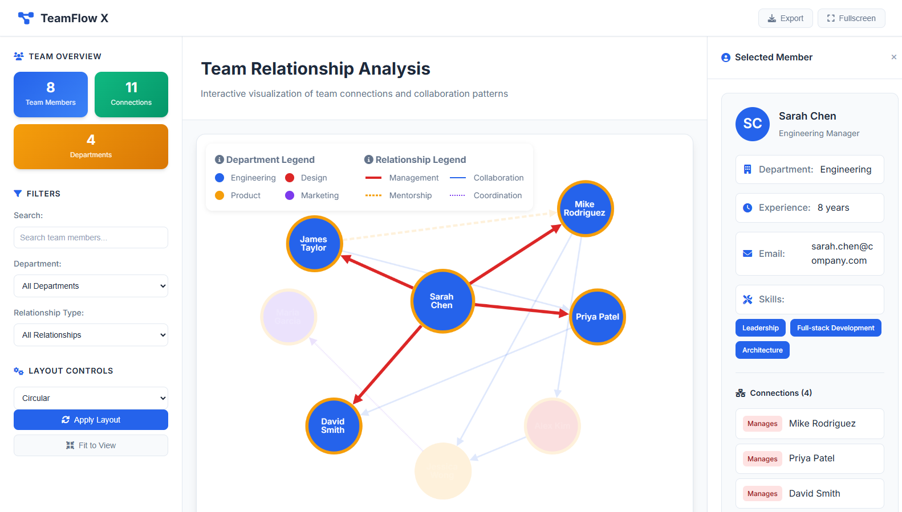

# TeamFlow X

  
  <b>An interactive, professional team network visualization built with Cytoscape.js. Displays team members as nodes and their relationships as edges, using data from a live API or local JSON file.</b> 
  <a href="https://teamflowx.vercel.app" target="_blank">Visit Now</a>

## Features
- **Live API Data**: Fetches team data from a configurable API endpoint, with automatic fallback to local `data.json` if the API is unavailable.
- **Interactive Graph**: Visualizes team structure, departments, and relationships.
- **Professional UI**: Sidebar with controls, info panel, export-ready image and overlays for legends.
- **Search & Filter**: Find team members by name, role, or skill. Filter by department and relationship type.
- **Layout Controls**: Switch between multiple graph layouts (force-directed, circular, grid, hierarchical, concentric).
- **Export**: Download the graph as an image.

## Technologies Used
- [Cytoscape.js](https://js.cytoscape.org/) for graph visualization
- HTML, CSS, JavaScript for UI and interactivity
- Font Awesome for icons

## Getting Started
1. **Clone or Download** this repository.
2. **Configure API Endpoint** (optional):
   - Edit `script.js` and set your API URL in the `apiConfig` object.
   - If the API fails, the app will automatically use `data.json`.
3. **Open `index.html`** in your browser. No build step required.
4. **Edit `data.json`** to update team members and relationships for local testing.

## File Structure
- `index.html` — Main application UI and structure
- `style.css` — Professional, responsive styling
- `script.js` — Data loading (API/local), graph logic, interactivity
- `data.json` — Team data (nodes and relationships)

## Customization
- **API Integration**: Update the API endpoint and transformation logic in `script.js` for your own backend.
- **Add/Edit Team Members**: Update `data.json` or your API data.
- **Change Colors/Styles**: Modify `style.css` for custom themes.
- **Adjust Legends**: Legends are overlaid inside the graph; edit in `index.html` as needed.

## Exporting the Graph
Use the export button in the UI to download the current graph view as an image. Legends are included in the export for clarity.

## License
MIT License

## Credits
- Cytoscape.js
- Font Awesome (for icons)
- JSONPlaceholder API (for data)

---
For questions or contributions, please open an issue or pull request.
